# DocSentinel — Authentication & Authorization Guide

This document details the architecture, configuration, role-based access control (RBAC), and deployment steps for the DocSentinel authentication system.

---

## 1. How Authentication Works

DocSentinel uses **stateless JSON Web Tokens (JWT)** combined with **OAuth 2.0 (Google)** and **bcrypt-hashed credentials (Default Admin)**.

```mermaid
sequenceDiagram
    autonumber
    actor User as User / Admin
    participant FE as React Frontend (Vite)
    participant BE as FastAPI Backend
    participant Google as Google Identity Server
    participant DB as PostgreSQL Database

    %% Admin Login Flow
    rect rgb(30, 30, 45)
    note right of User: Admin Login Flow
    User->>FE: Enters Admin Email & Password
    FE->>BE: POST /api/auth/admin/login
    BE->>DB: Query user by email
    DB-->>BE: User record + password_hash
    BE->>BE: bcrypt.checkpw(password, hash) & verify role == 'admin'
    BE-->>FE: Return JWT access_token + User profile
    FE->>FE: Store token in localStorage
    FE->>BE: GET /api/auth/me (Bearer Token)
    BE-->>FE: Current user info
    FE->>User: Redirect to /dashboard or /admin
    end

    %% Google OAuth Flow
    rect rgb(35, 45, 35)
    note right of User: Google OAuth Flow
    User->>FE: Clicks "Continue with Google"
    FE->>BE: GET /api/auth/google
    BE-->>FE: Return Google OAuth URL
    FE->>Google: Redirect browser to Google Consent Screen
    User->>Google: Authenticates with Google account
    Google->>BE: Redirects code to GET /api/auth/google/callback?code=...
    BE->>Google: POST https://oauth2.googleapis.com/token (code exchange)
    Google-->>BE: Return access_token & id_token
    BE->>Google: GET https://www.googleapis.com/oauth2/v3/userinfo
    Google-->>BE: Return profile (sub, email, name, picture)
    BE->>DB: Upsert user (role='user', google_id=sub)
    BE->>BE: Generate application JWT
    BE-->>FE: 302 Redirect to /auth/callback?token=JWT
    FE->>FE: Store token & load user profile
    FE->>User: Redirect to /dashboard
    end
```



---

## 2. Google Cloud Console Setup

To enable Google OAuth login, you must configure an OAuth 2.0 Web Application client in Google Cloud Console:

1. Go to the [Google Cloud Console](https://console.cloud.google.com/).
2. Select your project (e.g. `docsentinel-510117`).
3. Navigate to **APIs & Services > OAuth consent screen**:
   - User Type: **External** (or Internal for Google Workspace organizations).
   - App name: `DocSentinel`
   - User support email: Select your developer email.
   - Developer contact email: Enter your email.
   - Scopes: Add `openid`, `.../auth/userinfo.email`, and `.../auth/userinfo.profile`.
   - Test Users: Add any Google email accounts you wish to test with while the app is in "Testing" mode.
4. Navigate to **APIs & Services > Credentials**:
   - Click **+ Create Credentials > OAuth client ID**.
   - Application type: **Web application**.
   - Name: `DocSentinel Web Client`.
   - **Authorized JavaScript origins**:
     - `http://localhost:5173`
     - `http://127.0.0.1:5173`
     - `http://localhost:8000`
     - `http://127.0.0.1:8000`
     *(And your production domain, e.g., `https://app.docsentinel.io`)*
   - **Authorized redirect URIs**:
     - `http://localhost:8000/api/auth/google/callback`
     - `http://127.0.0.1:8000/api/auth/google/callback`
     *(And your production backend callback, e.g., `https://api.docsentinel.io/api/auth/google/callback`)*
5. Click **Create** and copy your **Client ID** and **Client Secret**.

---

## 3. Required Environment Variables

Configure these in `backend/.env` (and set production secrets on your server):

| Variable | Description | Example / Default |
|---|---|---|
| `PORT` | Backend port | `8000` |
| `DB_HOST` | PostgreSQL host | `localhost` |
| `DB_PORT` | PostgreSQL port | `5432` |
| `DB_NAME` | PostgreSQL database | `docsentinel_app` |
| `DB_USER` | PostgreSQL user | `postgres` |
| `DB_PASSWORD` | PostgreSQL password | `your_postgres_password` |
| `JWT_SECRET` | Secret key for signing JWTs | A 256-bit random string |
| `JWT_ALGORITHM` | JWT signing algorithm | `HS256` |
| `ACCESS_TOKEN_EXPIRE_MINUTES` | Expiration lifetime of tokens | `1440` (24 hours) |
| `GOOGLE_CLIENT_ID` | OAuth Client ID from Google Cloud | `*.apps.googleusercontent.com` |
| `GOOGLE_CLIENT_SECRET` | OAuth Client Secret from Google Cloud | `GOCSPX-...` |
| `GOOGLE_REDIRECT_URI` | Google OAuth callback redirect URI | `http://localhost:8000/api/auth/google/callback` |
| `FRONTEND_URL` | Base URL of frontend application | `http://localhost:5173` |
| `DEFAULT_ADMIN_EMAIL` | Default administrator email | `admin@docsentinel.local` |
| `DEFAULT_ADMIN_PASSWORD` | Default administrator password | `admin@098` |

*(See [.env.example](file:///c:/Users/kunju/OneDrive/Documents/Major%20Proj/DocSentinel/.env.example) for the unpopulated template)*

---

## 4. Default Admin Initialization

* When the FastAPI backend starts (`initialize_database` event in [main.py](file:///c:/Users/kunju/OneDrive/Documents/Major%20Proj/DocSentinel/backend/app/main.py)), `init_default_admin` in [auth_service.py](file:///c:/Users/kunju/OneDrive/Documents/Major%20Proj/DocSentinel/backend/app/services/auth_service.py) is automatically executed.
* It checks if a user with `DEFAULT_ADMIN_EMAIL` exists in PostgreSQL:
  * **If not found**: It hashes `DEFAULT_ADMIN_PASSWORD` with `bcrypt` (with automatic salt) and creates the administrator with role `admin` and `is_active=True`.
  * **If already found**: It does **not** duplicate the user or overwrite their current password. Subsequent application restarts are fully idempotent.
* Admin credentials are configured exclusively via environment variables and never committed to version control.

---

## 5. Role-Based Access Control (RBAC)

The system supports exactly three application roles:

1. **`Admin`**: Full application access, including account, permission, workflow, and administrative management.
2. **`Upload Maker`**: Document upload access allowed by the folder permission matrix.
3. **`Upload Checker`**: Assigned review access allowed by the folder permission matrix.

Google OAuth accounts default to `Upload Maker`. Role changes are stored on the user record and are read from the database for each authenticated request.

### Member Invitations

The Admin Settings page creates an active, passwordless account with the selected role. The application has no email delivery provider, so no invitation email is sent. The invited person signs in with Google using the same email address; Google OAuth links that verified account to the invitation. No additional mail environment variables are required.

### Backend Authorization Checks

Security is enforced at the **API layer**, never relying solely on frontend controls:
* Standard authenticated endpoints use `Depends(get_current_user)`.
* Admin-restricted endpoints use `Depends(require_admin)`:
  ```python
  @router.get("/admin/users", response_model=list[UserResponse])
  async def list_users_admin(current_user: User = Depends(require_admin)):
      ...
  ```
  If a user with `role="user"` accesses this endpoint, FastAPI returns `HTTP 403 Forbidden`.

### Frontend Route Guards

* **`ProtectedRoute`** in [RouteGuards.tsx](file:///c:/Users/kunju/OneDrive/Documents/Major%20Proj/DocSentinel/frontend/src/routes/RouteGuards.tsx): Blocks unauthenticated visitors and redirects to `/login`.
* **`AdminRoute`** in `frontend/src/routes/RouteGuards.tsx` protects both `/admin` and `/settings`, redirecting non-admin users to `/dashboard`.
* The sidebar hides Settings and Admin Panel from non-admin users.

---

## 6. API Reference

| Method | Endpoint | Protection | Description |
|---|---|---|---|
| `GET` | `/api/auth/google` | Public | Generates Google OAuth consent screen URL |
| `GET` | `/api/auth/google/callback` | Public | Google OAuth redirect callback; issues JWT |
| `POST` | `/api/auth/admin/login` | Public | Authenticates admin using email and password |
| `POST` | `/api/auth/login` | Public | General credentials login for users with password |
| `POST` | `/api/auth/logout` | `Bearer Token` | Logs out current session |
| `GET` | `/api/auth/me` | `Bearer Token` | Returns profile of current user |
| `GET` | `/api/auth/admin/users` | `Bearer Token (Admin)` | Lists all registered users and roles |

---

## 7. How to Run Locally

### Start Backend

```powershell
cd backend
# Activate virtual environment
.\venv312\Scripts\Activate.ps1   # or .\venv\Scripts\Activate.ps1

# Run Uvicorn server on port 8000
uvicorn app.main:app --reload --port 8000
```

### Start Frontend

```powershell
cd frontend
npm install
npm run dev
```
Open your browser at `http://localhost:5173`.

### Run Backend Automated Tests

```powershell
cd backend
.\venv312\Scripts\python.exe -m unittest tests/test_auth.py
```
*(Or with pytest: `pytest tests/test_auth.py -v`)*

---

## 8. Production Deployment Checklist

1. **HTTPS Enforcement**: Always deploy frontend and backend behind TLS/HTTPS in production.
2. **CORS Configuration**: Update `allow_origins` in `backend/app/main.py` and `FRONTEND_URL` in `.env` to match your production domain.
3. **JWT Secret**: Generate a cryptographically secure 64-character secret for `JWT_SECRET` (`openssl rand -hex 32`).
4. **Google OAuth URIs**: Add your production domain to Authorized Origins and Redirect URIs in Google Cloud Console.
5. **Change Default Admin Password**: Change `DEFAULT_ADMIN_PASSWORD` in your production environment variables before initial launch.
