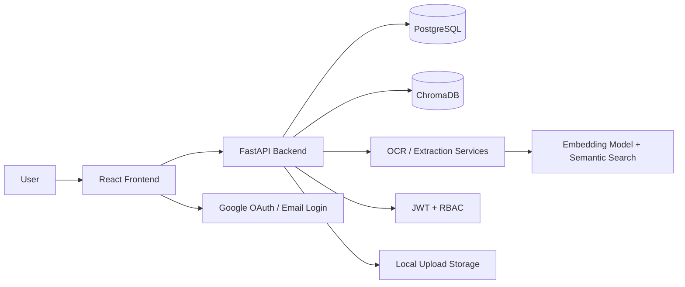
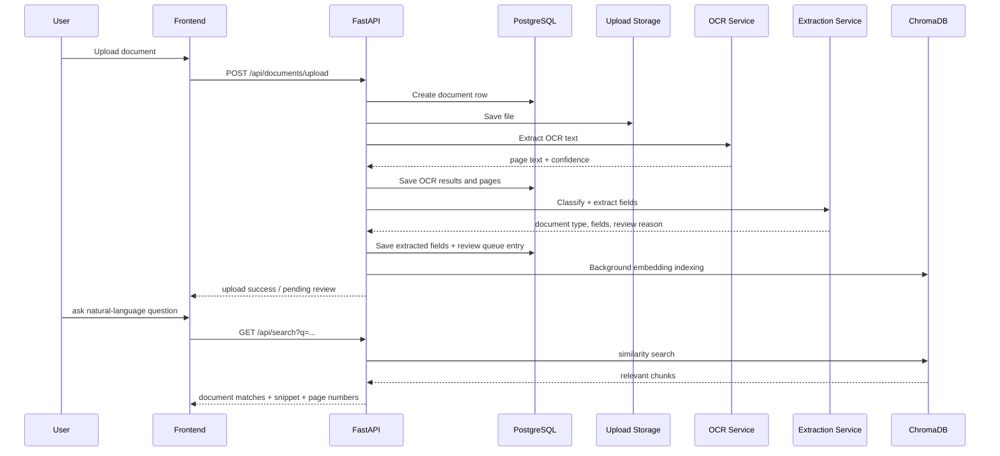

# DocSentinel: Features, Flow, Architecture, and Implementation Details

## 1. Project purpose

DocSentinel is an AI-powered document management and review system built for organizations that need to:

- upload PDFs, Office files, images, and scanned documents,
- extract text from them automatically,
- classify and organize documents by type and department,
- search either by keyword or by semantic meaning,
- review and approve or reject processed documents with role-based access control,
- control document access by user role and department,
- manage admin configuration for users, permissions, and workflow rules.

It combines a React frontend, a FastAPI backend, PostgreSQL for relational data, ChromaDB for vector search, and AI/ML services for OCR, extraction, and semantic search.

---

## 2. What is being used in the system

### Frontend
- React + TypeScript
- Vite for project build and local dev server
- React Router for page routing
- Material UI style components/icons (used throughout the pages)
- Axios-based API client for backend communication

### Backend
- FastAPI
- SQLAlchemy ORM
- Pydantic validation
- PostgreSQL database
- JWT-based authentication
- Google OAuth support
- Role-based access control logic

### AI and document-processing stack
- OCR: RapidOCR + PaddleOCR (with multilingual support for English + Devanagari languages)
- Language detection: custom script and terminology-based detection for English, Hindi, and Marathi
- Embeddings: SentenceTransformers (`sentence-transformers/paraphrase-multilingual-MiniLM-L12-v2`)
- Vector DB: ChromaDB (persistent local vector store)
- Search: hybrid keyword + semantic retrieval
- Extraction: regex-based structured field extraction and document type classification

### Storage and persistence
- Local upload directory for original files
- PostgreSQL for users, documents, OCR results, review queue, workflow config
- ChromaDB for chunk embedding storage and semantic vector retrieval

---

## 3. High-level architecture

### Architectural idea

The system separates concerns into independent layers:

1. Presentation layer: React app for login, dashboard, upload, library, review, admin management.
2. API layer: FastAPI routes handle authentication, document workflows, search, and admin operations.
3. Service layer: OCR, extraction, embedding, search, admin config, and workflow logic.
4. Data layer: PostgreSQL for structured records and ChromaDB for vector similarity search.
5. Security layer: JWT tokens, role checks, and folder/document permission validation.

---

## 4. Role model and access design

The application supports three main roles:

- Admin
- Upload Maker
- Upload Checker

### Role rules implemented in code

- Admin can access all documents and admin screens.
- Upload Maker can upload documents and can usually view documents in their department or their own uploaded docs.
- Upload Checker can review assigned documents and is restricted by department and assignment.
- Separation of duties is enforced: a checker or admin cannot review a document that they uploaded themselves.

### How access is enforced

The backend uses dependencies such as:

- `get_current_user()` — validates JWT and loads the signed-in user.
- `require_admin()` — blocks non-admin access to admin routes.
- `require_upload_maker()` — allows upload permissions only for makers/admins.
- `require_upload_checker()` — allows review permissions only for checkers/admins.
- `verify_document_view_access()` and `verify_document_review_access()` — check department permissions and review rules before viewing or accepting/rejecting documents.

This is not just UI gating; the backend enforces the same rules for every API call.

---

## 5. Authentication and user flow

### Login methods

The backend exposes:

- `POST /api/auth/login` — email/password login
- `POST /api/auth/admin/login` — admin-only login
- `GET /api/auth/google` — Google OAuth URL generation
- `GET /api/auth/google/callback` — Google ID token/OAuth flow completion

### JWT flow

1. A user logs in with credentials or via Google.
2. The backend validates the login.
3. A JWT is created using the user id, email, role, and name.
4. The frontend stores the token in local storage.
5. Every protected API call uses the Bearer token in the Authorization header.
6. The backend decodes and validates the token for each request.

### Google OAuth flow

- Frontend requests the Google authorization URL.
- User authenticates with Google.
- Google redirects back to the backend callback endpoint.
- The server exchanges the code for Google user info.
- The app upserts the user into the database.
- A new app JWT is generated and passed back to the frontend callback page.

This makes social login and password login use the same app-level access model.

---

## 6. File upload feature

### Route
- `POST /api/documents/upload`

### What happens during upload

1. User selects a file from the frontend upload page.
2. Frontend sends the file and optional department or document type metadata to the backend.
3. Backend validates the language choice and file type context.
4. File is saved into the local `uploads` directory.
5. A database record is created for the document with metadata such as original name, stored file name, uploader, department, and status.
6. OCR/extraction processing begins immediately.
7. The document may be assigned a review queue item after classification.
8. The document is marked pending review and then asynchronously indexed into ChromaDB for semantic search.

### Important implementation details

- The file is stored physically in the server’s upload folder.
- The database stores a reference to the file path and metadata.
- Upload permissions are checked before processing.
- If the process fails, the backend marks the document as failed instead of crashing the whole app.

---

## 7. OCR and multilingual document processing

### OCR engine selection

The backend uses custom OCR engine selection logic in `ocr_service.py`:

- RapidOCR for general/fallback OCR
- PaddleOCR for deeper OCR support, especially for multilingual content
- Language detection for English, Hindi, Marathi, and mixed scripts

### Why this matters

The project explicitly supports multilingual document ingestion, including Devanagari script. That is a major implementation detail, not a minor feature.

### OCR pipeline

1. The system reads the uploaded file.
2. It detects the document type and image/PDF context.
3. The OCR engine extracts page text and per-page confidence scores.
4. Each page is stored in `document_pages` and the OCR text in `ocr_results`.
5. The combined text is cleaned and normalized.
6. The cleaned text is passed to the extraction layer.

### Language detection logic

The code checks:

- Latin script vs Devanagari script
- Hindi vs Marathi word usage patterns
- mixed-language content
- confidence scores for detected language

This is used to better handle Indian-language forms, certificates, invoices, and compliance documents.

---

## 8. AI extraction and classification feature

### Core service
- `extract_document_report()` in `extraction_service.py`

### What it does

The system takes OCR text and performs:

- document type detection,
- department classification,
- key field extraction,
- overall confidence scoring,
- review trigger evaluation.

### Example field extraction

The project detects structured fields such as:

- document_number
- date
- full_name
- total_amount
- email
- phone
- organization
- address

These are found using regex patterns and confidence scoring. The output is stored in `extracted_fields`.

### Document classification rules

The classification system maps content keywords to document types and departments, for example:

- Invoices → Finance
- Contracts → Legal
- Employee records → HR
- SOPs → Operations
- Technical documentation → IT

The classification score determines whether the document is likely to require approval or not.

### Review trigger logic

If there is low confidence or a suspicious document pattern, the system generates a review queue item with a reason and confidence score. This is a workflow control function rather than a passive log.

---

## 9. Document review and approval workflow

### Review queue model

A review queue record is created for each document that enters the review path.

The system records:

- the document id,
- reason for review,
- confidence score,
- queue status,
- reviewer assignment or route logic.

### Allowed review actions

Files can be reviewed by:

- Admin
- Upload Checker assigned to that document or department

A user cannot approve their own upload due to separation-of-duties rules.

### Document statuses

The system uses document states like:

- UPLOADED
- PENDING_REVIEW
- APPROVED
- REJECTED
- NEEDS_REVISION

### Important workflow behavior

The upload pipeline does the following:

- determine a department,
- assign a review reason,
- add a review item,
- set the document to pending review,
- schedule embedding indexing in the background.

This means upload, OCR, extraction, and review all happen as one document lifecycle rather than separate disconnected modules.

---

## 10. Search feature

There are two search modes implemented in the project.

### 10.1 Keyword search

Used in the document listing endpoints and hybrid search.

It searches document fields such as:

- original file name,
- extracted OCR text,
- extracted field names,
- extracted field values,
- corrected/original values.

It also respects RBAC filters so users only see documents they are allowed to access.

### 10.2 Semantic search

The project indexes document chunks into ChromaDB with embeddings.

Each chunk is stored with:

- document_id
- page_number
- chunk_index
- filename
- text_preview

When a user asks a question, the system:

1. encodes the query with the same embedding model,
2. runs a similarity search in ChromaDB,
3. retrieves the top relevant chunks,
4. returns the matching document name, page number, and snippet,
5. uses highlight terms and snippet extraction to improve explanation quality.

### Hybrid search

The search endpoint supports `mode=hybrid`, `keyword`, or `semantic`:

- hybrid search combines keyword and semantic retrieval,
- keyword mode does exact/partial string matching,
- semantic mode uses vector similarity only.

This is useful because a document repository often contains both obvious text matches and meaning-based content that a literal keyword cannot find.

---

## 11. Document library and dashboard

### Dashboard

The frontend dashboard shows summary statistics and recent documents. It pulls document stats from backend endpoints and presents the current state of the repository.

### Library screen

The library is the main listing screen. It allows users to:

- browse documents,
- see metadata,
- filter by status, department, file type, or type,
- search by free text,
- open preview content or source document details.

### RBAC filter behavior

The backend applies access filtering before returning documents:

- Admin sees all documents.
- Upload Maker sees documents in their department or created by them.
- Upload Checker sees only assigned or permitted documents.

This is a default behavior, not a UI-only restriction.

---

## 12. Admin feature set

The admin area controls the operational settings of the platform.

### Admin functions implemented

- invite new users,
- update user roles,
- deactivate users,
- assign department,
- manage workflow rules,
- manage folder permissions,
- configure review thresholds and routing logic,
- initialize default permissions and admin account on startup.

### Folder permissions matrix

The admin can configure by folder/doc type:

- admin access
- upload maker access
- upload checker access

This is stored in database tables and checked at runtime.

### Workflow rules

The workflow system supports route thresholds and rules such as:

- warning
- security
- claims

These rules can route a document to a team or trigger review for low-confidence or high-risk content.

---

## 13. Embedding and vector indexing flow

This is a crucial backend feature.

### Why it exists

The system needs semantic relevance, not just exact keyword matching. The vector database addresses that problem.

### Indexing sequence

1. A document is uploaded and processed.
2. OCR text is stored in the database.
3. The system calls `schedule_document_indexing(document_id)`.
4. A background thread runs `index_document_embeddings(...)`.
5. The OCR text is chunked into fixed-size text blocks with overlap.
6. Each chunk is encoded with the embedding model.
7. ChromaDB receives all chunks and metadata.
8. The document is marked as indexed if the operation succeeds.

### Reindex behavior

On startup, the system checks for documents with OCR text but no embedding rows and backfills the vector index automatically.

This makes the embed/search system resilient and avoids full re-uploading when the app restarts.

---

## 14. Backend data model overview

### Core database entities

- `users` — user identities, roles, departments, profiles, login metadata
- `documents` — metadata for every uploaded document
- `document_pages` — page-level metadata
- `ocr_results` — extracted OCR content per page or document
- `extracted_fields` — structured data extracted from text
- `review_queue` — pending review and review actions
- `embedding_index` — mapping between DB document records and Chroma vectors
- `folder_permission` — role-based folder access settings
- `workflow_setting` — global review thresholds
- `workflow_rule` — routing rules by document type or risk level

The design separates exact relational queries (users, roles, access, document metadata) from semantic or approximate similarity search (vector datastore).

---

## 15. End-to-end request lifecycle

---

## 16. Security stance of the application

### Implemented security controls

- JWT validation for protected routes
- Role-specific access enforcement
- department-based access rules
- document uploader vs reviewer conflict prevention
- backend permission checking on every critical operation, not only in frontend routes
- local environment configuration for secret values and OAuth credentials

### Why this is important

A document review system is only useful if the wrong role cannot read or approve the wrong files. The RBAC layer is therefore a primary system feature, not an optional extension.

---

## 17. Frontend behavior summary

The frontend reflects the backend system in a user-friendly way:

- Login screen with standard login and Google login
- Dashboard with summary metrics and recent documents
- Upload page with drag-and-drop support and file preview
- Library with search, filters, and access-aware listing
- Ask Question page for semantic search and relevant document passages
- Review screen for assigned documents
- Admin settings for user roles, permissions, workflow rules
- Profile page for current user information

This is a complete operational workflow for a document governance system, not just a demo UI.

---

## 18. Strengths of the current implementation

- Strong separation of concerns between API, services, and storage
- Clear role and permission enforcement
- OCR and semantic search are wired into the same document lifecycle
- Review and approval logic is built into the backend
- Admin configuration is centralized and persisted to DB
- System supports multilingual document text and Indian-language contexts

---

## 19. Current limitations / areas to extend

This project is already feature-rich, but there are a few practical extension points:

- Local file storage is acceptable for development; production would usually use object storage such as MinIO or S3.
- OCR is processing-heavy and could be moved to a background worker or queue in a larger deployment.
- The extraction system is regex/keyword-based and may need stronger ML models for production-grade extraction accuracy.
- The vector search is local and persistent, which is excellent for local/dev scenarios but not yet a full enterprise-scale deployment architecture.

---

## 20. Final summary

DocSentinel is designed as a practical AI document intelligence platform with a real access-control model and a working ingestion-to-search lifecycle. The key idea is simple:

- upload a document,
- extract and classify its content,
- store it in a searchable and reviewable database,
- restrict what users can access by role and department,
- enable semantic retrieval to answer questions grounded in the company’s actual documents.

In other words, the system is not just a search box; it is a complete document intelligence workflow spanning ingestion, parsing, review, security, and retrieval.
